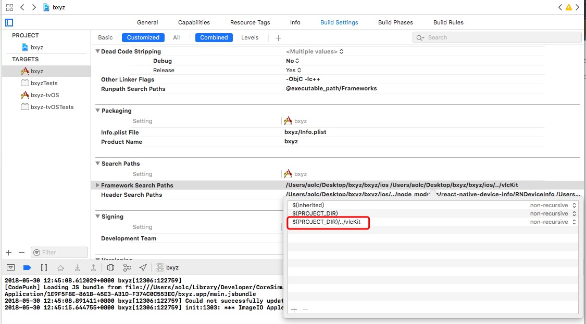

[Toc]
# react-native-yz-vlcplayer

A `<VLCPlayer>` component for react-native  
此项目 参考react-native-video，react-native-vlcplayer, react-native-vlc-player

VLCPlayer 支持各种格式(mp4,m3u8,flv,mov,rtsp,rtmp,etc.)，具体参看[vlc wiki](https://wiki.videolan.org/Documentation:Documentation/)


### Add it to your project

Run `npm install react-native-yz-vlcplayer --save`


## android

android vlc-sdk 库来源:[https://github.com/mengzhidaren/Vlc-sdk-lib](https://github.com/mengzhidaren/Vlc-sdk-lib)

Run `react-native link react-native-yz-vlcplayer`


## ios (暂不支持，待整合)
https://github.com/xuyuanzhou/react-native-vlcplayer
整合 react-native-vlcplayer 而来。

Run `react-native link react-native-yz-vlcplayer`

1.安装MobileVLCKit.framework
(1)在[nightlies.videolan.org/build/iOS/](http://nightlies.videolan.org/build/iOS/) 下载最新版，

(2)在你的项目目录下新建一个 vlcKit 文件夹，并将MobileVLCKit.framework解压到该目录下

(3)在你的工程里面引入MobileVLCKit.framework
   
   
   
(4)添加 framework search path     `$(PROJECT_DIR)/../vlcKit`
   
   
(5)Enable Bitcode 设置为no
   Build Settings ---> 查询  Bitcode


## FullScreen ##
需要用到 `npm install react-native-orientation --save` ，工程配置参看[https://github.com/yamill/react-native-orientation](https://github.com/yamill/react-native-orientation)  

## Static Methods

`seek(seconds)`

```
this.vlcplayer.seek(100); //单位是 ms
this.vlcPlayer.resume(autoplay) //重新加载视屏进行播放,autopaly: true 表示播放 false表示暂停
```


## Examples

````
   import { VLCPlayer, VlCPlayerView } from 'react-native-yz-vlcplayer';
   import Orientation from 'react-native-orientation';
   
   //插件参数说明
   (1) 静态方法
       this.vlcplayer.seek(100); //调整播放进度，单位是ms
  （2）
       <VLCPlayer
           ref={ref => (this.vlcPlayer = ref)}
           style={[styles.video]}
           /**
            *  是否暂停播放
            */
           paused={this.state.paused}
           /**
            *  资源路径
            *  暂不支持本地资源
            */
           source={{ uri: this.props.uri}}
           /**
            *  进度   
            *  返回 {currentTime:1000,duration:1000} 
            *  单位是 ms
            *  currentTime: 当前时间  
            *  duration:    总时间  
            */
           onProgress={this.onProgress.bind(this)}
           /**
            *  视屏播放结束
            */
           onEnd={this.onEnded.bind(this)}
           /**
            * 正在缓存中
            */
           onBuffering={this.onBuffering.bind(this)}
           onError={this._onError}
           //onStopped={this.onEnded.bind(this)}      暂未实现
           //onPlaying={this.onPlaying.bind(this)}    暂未实现
           //onPaused={this.onPaused.bind(this)}      暂未实现
       />
   （3）简单例子
       <VlCPlayerView
           autoplay={false}                //视屏播放结束时调用this.vlcPlayer.resume(false)方法
           url={this.state.url}           //视屏url
           Orientation={Orientation}      
           //BackHandle={BackHandle}
           ggUrl=""                      // 广告url
           showGG={true}                 // 是否显示广告
           startFullScreen={() => {      
              this.setState({
              isFull: true,
             });
           }}
           closeFullScreen={() => {
              this.setState({
              isFull: false,
             });
           }}
       />
````


**MIT Licensed**
