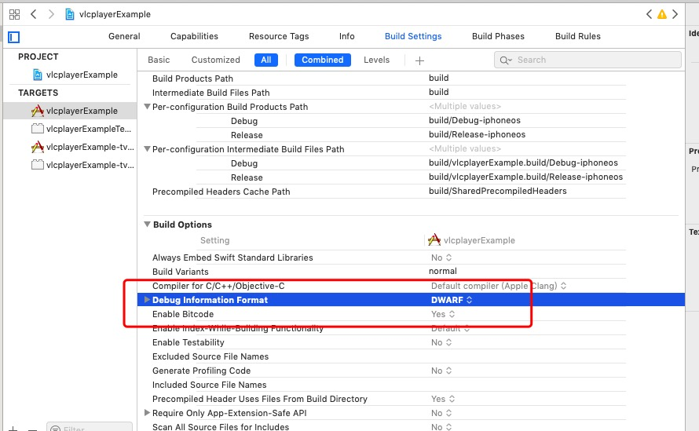
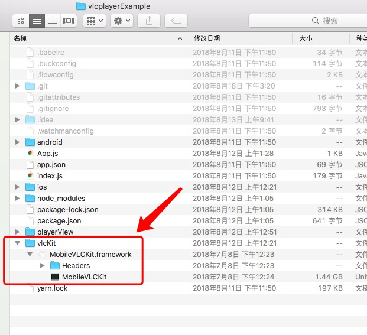
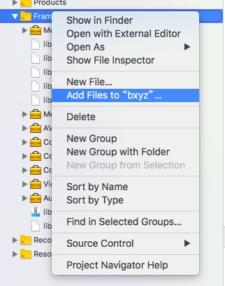
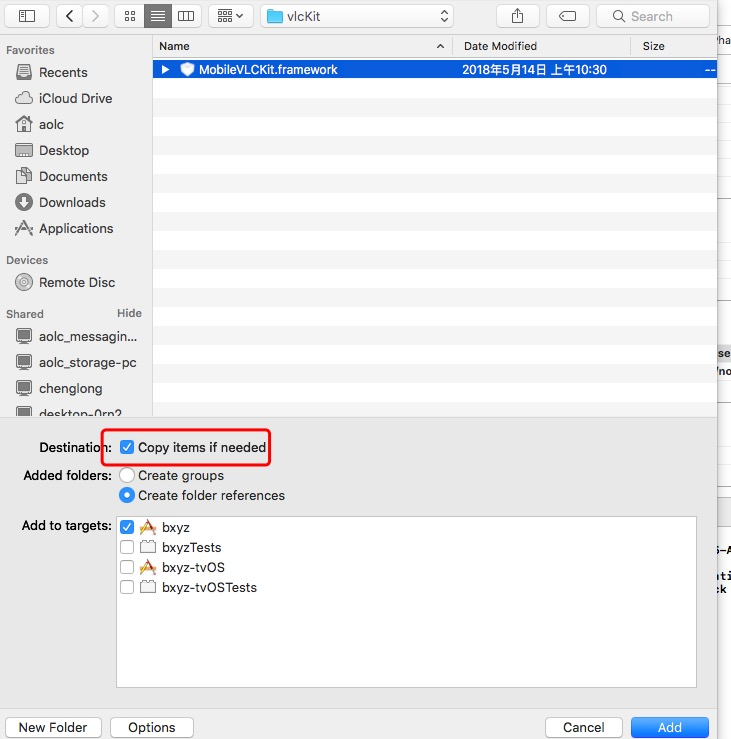
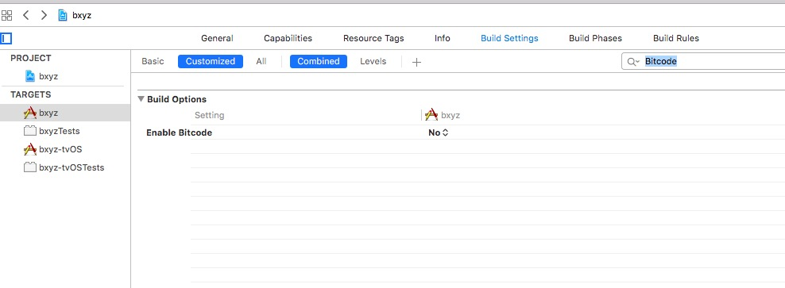

# react-native-yz-vlcplayer

A `<VLCPlayer>` component for react-native
此项目 参考[react-native-video](https://github.com/react-native-community/react-native-video)，
[react-native-vlcplayer](https://github.com/xiongchuan86/react-native-vlcplayer),
[react-native-vlc-player](https://github.com/ghondar/react-native-vlc-player)

VLCPlayer 支持各种格式(mp4,m3u8,flv,mov,rtsp,rtmp,etc.)，具体参看[vlc wiki](https://wiki.videolan.org/Documentation:Documentation/)

[https://code.videolan.org/videolan/VLCKit](https://code.videolan.org/videolan/VLCKit)


## Example project

   [https://github.com/xuyuanzhou/vlcplayerExample](https://github.com/xuyuanzhou/vlcplayerExample)

   


## Xcode10+ 的一些问题

（1）libstdc++.6.0.9.tbd 找不到
     在Xcode10中，libstdc++.6.0.9.tbd被移除掉了，我们也移除掉它就OK了

（2）编译卡死的情况(目前只能等官方修正这个问题)

   [https://forums.developer.apple.com/thread/107570](https://forums.developer.apple.com/thread/107570)

   (1)去除DSYM

   项目  Build Settings  --> Build Options --> Debug Information Format  设置为 DWARF.

   

   (2)改为Xcode10以下版本编译


###  install

     `npm install react-native-yz-vlcplayer --save`


## android setup

android vlc-sdk from:[https://github.com/mengzhidaren/Vlc-sdk-lib](https://github.com/mengzhidaren/Vlc-sdk-lib)

step 1:

Run `react-native link react-native-yz-vlcplayer`


## ios setup

combined from  [react-native-vlcplayer](https://github.com/xiongchuan86/react-native-vlcplayer) 。

reference: [https://code.videolan.org/videolan/VLCKit](https://code.videolan.org/videolan/VLCKit)

step 1:

   Run `react-native link react-native-yz-vlcplayer`

step 2:

   download  MobileVLCKit.framework from  [nightlies.videolan.org/build/iOS/](http://nightlies.videolan.org/build/iOS/)

step 3:

   create a folder named vlcKit, and copy MobileVLCKit.framework in this folder.

   

step 4:

   In XCode, in the project navigator, right click Frameworks -> Add Files to [your project's name], go to `/vlckit` and add MobileVLCKit.framework


   

   

step 5:

   add framework search path:      `$(PROJECT_DIR)/../vlcKit`

   


step 6:

   Select your project. Add the following libraries to your project's Build Phases -> Link Binary With Libraries:

   * AudioToolbox.framework
   * VideoToolbox.framework
   * CoreMedia.framework
   * CoreVideo.framework
   * CoreAudio.framework
   * AVFoundation.framework
   * MediaPlayer.framework
   * libstdc++.6.0.9.tbd
   * libiconv.2.tbd
   * libc++.1.tbd
   * libz.1.tbd
   * libbz2.1.0.tbd

step 7:

   set `Enable Bitcode`  to  `no`

   Build Settings ---> search  Bitcode

   


step 8:

  set project deployment target  `9.3`


## other react-native plugins

   1. npm install react-native-orientation --save

      react-native link react-native-orientation

   2. npm install react-native-slider --save

   3. npm install react-native-vector-icons --save

      react-native link react-native-vector-icons


## Static Methods

`seek(seconds)`

```
android:
    this.vlcplayer.seek(100); //  unit(单位)  ms
ios:
    this.vlcplayer.seek(0.1); //  0 --- 1 视频位置进度


this.vlcPlayer.resume(autoplay) //重新加载视频进行播放,autopaly: true 表示播放 false表示暂停

this.vlcPlayer.play(bool)       // true: play the video   false: paused the video


this.vlcPlayer.snapshot(path)  // path: string  存储的文件的路径。


```

##  VLCPlayer props

    import { VLCPlayer } from 'react-native-yz-vlcplayer';

   | props       | type     |  value  |   describe |
   | --------    | :----:   |  :----:  |   :----:   |
   | paused      | bool     |         |            |
   | muted       | bool     |         |            |
   | volume      | bool     | 0---200 |            |
   | hwDecoderEnabled | number  | 0  or  1 |   (Only android)  need  use with hwDecoderForced |
   | hwDecoderForced  | number  | 0  or  1 |   (Only android)  need  use with hwDecoderEnabled|
   | initType    | number   |         |            |
   | initOptions | array    |         |            |
   | mediaOptions| object   |         |            |
   | source      | object   | { uri: 'http:...' }| |
   | autoplay    | bool     |       |  是否自动播放（默认false）        |
   | onLoadStart | func     |       |  vlc视频容器初始化完毕  |
   | onOpen      | func     |       |  视频被打开            |
   | onBuffering | func     |       |  正在缓冲中           |
   | onProgress  | func     | { currentTime:1000,duration:1000 }  unit：ms    |  视频进度发生改变     |
   | onEnd       | func     |       |  视频播放结束        |
   | onPlaying   | func     |       |  视频正在播放        |
   | onPaused    | func     |       |  视频暂停           |
   | onError     | func     |       |  播放视频出错       |
   | onStopped   | func     |       |  视频停止播放(直播视频请根据这个判断) |
   | onIsPlaying | func     | {isPlaying:true}   |  视频是否正在播放       |


   ```
      initType:   1,2     default value: 1
        example:
             ios:
                   1: [[VLCMediaPlayer alloc] init]
                   2: [[VLCMediaPlayer alloc] initWithOptions:options];

   ```

   initOptions:

   [https://wiki.videolan.org/VLC_command-line_help](https://wiki.videolan.org/VLC_command-line_help)

   [https://www.cnblogs.com/waimai/p/3342739.html](https://www.cnblogs.com/waimai/p/3342739.html)


   ```
      onBuffer:

        android: {
                    isPlaying: true,
                    bufferRate: 70,
                    duration: 0,
                 }

            ios: {
                   duration: 0,
                   isPlaying: true,
                 }

      onProgress:

                {
                    currentTime: 1000        ms
                    duration: 5000           ms
                }

      onIsPlaying:

                {
                    isPlaying: true
                }


   ```


## 回调函数简单说明（目前碰到的）
 ```
                                                             支持平台
           onEnd            视频播放结束                  ios       android
           onBuffering      正在缓冲中                    ios       android
           onError          播放视频出错
           onPlaying        视频播放                      ios       android
           onPaused         视频暂停                      ios       android
           onOpen           视频被打开                              android
           onLoadStart      vlc视频容器初始化完毕          ios       android
           onProgress       视频进度发生改变               ios       android          swf格式不支持

           回调函数出现顺序:  onLoadStart  ---> onOpen

 ```


##  use plugin
````
   import { VLCPlayer, VlCPlayerView } from 'react-native-yz-vlcplayer';
   import Orientation from 'react-native-orientation';

   (1)
       android:
           this.vlcplayer.seek(100); // 单位是 ms
       ios:
           this.vlcplayer.seek(0.1); // 0 --- 1 视频位置进度
  （2）
       <VLCPlayer
           ref={ref => (this.vlcPlayer = ref)}
           style={[styles.video]}
           /**
            *  增加视频宽高比，视频将按照这个比率拉伸
            *  不设置按照默认比例
            */
           videoAspectRatio="16:9"
           /**
            *  是否暂停播放
            */
           paused={this.state.paused}
           /**
            *  资源路径
            *  暂不支持本地资源
            */
           source={{ uri: this.props.uri}}
           /**
            *  进度
            *  返回 {currentTime:1000,duration:1000}
            *  单位是 ms
            *  currentTime: 当前时间
            *  duration:    总时间
            */
           onProgress={this.onProgress.bind(this)}
           /**
            *  视频播放结束
            */
           onEnd={this.onEnded.bind(this)}
           /**
            * 正在缓存中
            */
           onBuffering={this.onBuffering.bind(this)}
           /**
            * 播放视频出错
            */
           onError={this._onError}
           /**
            * 视频停止
            */
           onStopped={this.onStopped.bind(this)}
           /**
            * 视频播放
            */
           onPlaying={this.onPlaying.bind(this)}
           /**
            * 视频暂停
            */
           onPaused={this.onPaused.bind(this)}
           /**
            * 视频被打开
            /
           onOpen={this._onOpen}
           /**
            * vlc视频容器初始化完毕
            * 在这里进行设置播放的进度，是否开始播放
            */
           onLoadStart={()=>{
                   if(Platform.OS === 'ios'){
                       this.vlcPlayer.seek(0); //设置播放进度
                   }else{
                       this.vlcPlayer.seek(0); //设置播放的时间
                   }
                   this.setState({
                     paused: true,
                   },()=>{
                     this.setState({
                       paused: false,
                     });
                   })
           }}
       />

````


## Simple Example

````
   (1)
      1. npm install react-native-orientation --save

         react-native link react-native-orientation

      2. npm install react-native-slider --save

      3. npm install react-native-vector-icons --save

         react-native link react-native-vector-icons

   (2)

       import { VLCPlayer, VlcSimplePlayer } from 'react-native-yz-vlcplayer';
       import Orientation from 'react-native-orientation';


       <VlcSimplePlayer
           ref={ ref => this.vlCPlayerView = ref}
           url={"rtmp://live.hkstv.hk.lxdns.com/live/hks"}
           Orientation={Orientation}
       />

       注意：
        《1》插件默认用了如下所示的宽高比(1.1.1-beta1及以下)
            fullVideoAspectRatio: deviceHeight + ':' + deviceWidth,
            videoAspectRatio: deviceWidth + ':' + 211.5,
            （1）在竖屏情况下画面比例会出现问题，请自行设置宽高比或去除内置宽高比
            （2）非全屏下修改了默认高度的话，请自行设置宽高比或去除内置宽高比
                去除内置宽高比：
                            fullVideoAspectRatio={""}
                            videoAspectRatio={""}
        《2》默认不会自动播放，需要自动播放请添加如下参数
             autoplay={true}

        《3》 你可以自定义文字用以下参数:
                endingViewText: {
                    endingText: '视频播放结束',
                    reloadBtnText: '重新播放',
                    nextBtnText: '下一个'
                },
                errorViewText: {
                    errorText: '视频播放出错',
                    reloadBtnText: '重新播放',
                },
                vipEndViewText: {
                    vipEndText: '试看结束',
                    boughtBtnText: '请购买后观看立即购买',
                },

      下面是可用的一些参数：

       static propTypes = {

        /**
            * vlc 播放类型相关
            */
               //广告初始化类型
               initAdType: PropTypes.oneOf([1,2]),
               //广告初始化参数
               initAdOptions: PropTypes.array,

               //视频初始化类型
               initType: PropTypes.oneOf([1,2]),
               //视频初始化参数
               initOptions: PropTypes.array,

           /**
            * 直播相关
            */
                //是否直播
                isLive: PropTypes.bool,
                //是否自动reload  live
                autoReloadLive: PropTypes.bool,

           /**
            * 广告相关
            */
               //是否显示广告
               showAd:  PropTypes.bool,
               //广告url
               adUrl: PropTypes.oneOfType([PropTypes.string,PropTypes.number]).isRequired,
               //重新加载包括广告
               reloadWithAd: PropTypes.bool,
               //广告头播放结束
               onAdEnd: PropTypes.func,
               //广告是否在播放
               onIsAdPlaying: PropTypes.func,


           /**
            * 屏幕相关
            */
           // 以全屏初始化
           initWithFull: PropTypes.bool,
           //开启全屏回调函数
           onStartFullScreen: PropTypes.func,
           //关闭全屏回调函数
           onCloseFullScreen: PropTypes.func,

           /**
            * 视频相关
            */

               //视频路径：
                    //string:  本地或者网络资源路径
                    //number:  require('./resource/1.mp4')
               url: PropTypes.oneOfType([PropTypes.string,PropTypes.number]).isRequired,
               //视频播放结束
               onEnd: PropTypes.func,
               //是否在播放
               onIsPlaying: PropTypes.func,
               //已经观看时间
               lookTime: PropTypes.number,
               //总时间
               totalTime: PropTypes.number,
               //是否有下一视频源
               hadNext: PropTypes.bool,
               //自动播放下一个视频
               autoPlayNext: PropTypes.bool,
               //自动重复播放
               autoRePlay: PropTypes.bool,


           /**
            * 样式相关
            */
               //视频样式
               style: PropTypes.object,
               //全屏视频样式
               fullStyle: PropTypes.object,
               //是否需要考虑statusBar   only for ios
               considerStatusBar: PropTypes.bool,
               //是否显示顶部
               showTop: PropTypes.bool,
               //标题
               title: PropTypes.string,
               //是否显示标题
               showTitle: PropTypes.bool,
               //是否显示返回按钮
               showBack: PropTypes.bool,
               //返回按钮点击事件
               onLeftPress: PropTypes.func,

           /**
            * vip相关
            */
               //是否使用vip
               useVip: PropTypes.bool,
               //非vip观看长度
               vipPlayLength: PropTypes.number,

         };

````

````
    /**
     * Sample React Native App
     * https://github.com/facebook/react-native
     *
     * @format
     * @flow
     */

    import React, {Component} from 'react';
    import {StyleSheet, View} from 'react-native';
    import {VlcSimplePlayer, VLCPlayer}  from 'react-native-yz-vlcplayer';


    export default class App extends Component<Props> {
        render() {
            return (
                <View style={styles.container}>
                <VlcSimplePlayer
                    autoplay={false}
                    url='rtsp://184.72.239.149/vod/mp4://BigBuckBunny_175k.mov'
                    initType={2}
                    hwDecoderEnabled={1}
                    hwDecoderForced={1}
                    initOptions={[
                        "--no-audio",
                        "--rtsp-tcp",
                        "--network-caching=" + 150,
                        "--rtsp-caching=" + 150,
                        "--no-stats",
                        "--tcp-caching=" + 150,
                        "--realrtsp-caching=" + 150,
                    ]}
                />
                <VLCPlayer
                    style={{width:"100%",height:200,marginTop:30}}
                    source={{uri:'rtsp://184.72.239.149/vod/mp4://BigBuckBunny_175k.mov'}}
                    initType={2}
                    initOptions={[
                        "--no-audio",
                        "--rtsp-tcp",
                        "--network-caching=" + 150,
                        "--rtsp-caching=" + 150,
                        "--no-stats",
                        "--tcp-caching=" + 150,
                        "--realrtsp-caching=" + 150,
                    ]}
            />
            </View>
        );
        }
    }

    const styles = StyleSheet.create({
        container: {
            flex: 1,
            justifyContent: 'center',
            alignItems: 'center',
            backgroundColor: '#F5FCFF',
        },
    });

````


**MIT Licensed**
